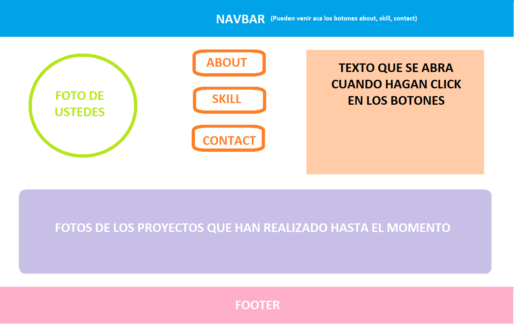

# Clase practica de estilos con react

## Contenido:

La idea de esta clase es poder practicar estilos, y estar ayudandolos para lo que necesiten

Pueden utilizar la forma de estilos que prefieran, MUI, u otro framework.

## Contenido:
La siguiente imagen es solo a modo de ejemplo, puede estar redistribuido como deseen pero deberia contar con:
1. Navbar
2. Botones de about, contact, skill (cuando veamos rutas lo podran hacer en rutas distintas) Puede ir en la Navbar o en otro lado
3. Foto de ustedes (Puede ir en la Navbar o en otro lado)
4. Proyectos hechos
5. Footer (es opcional)

